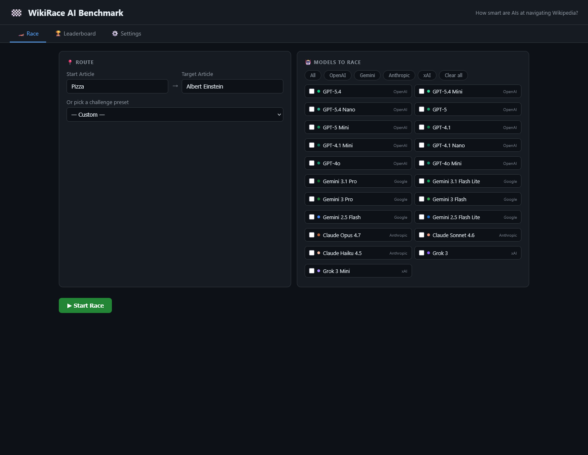
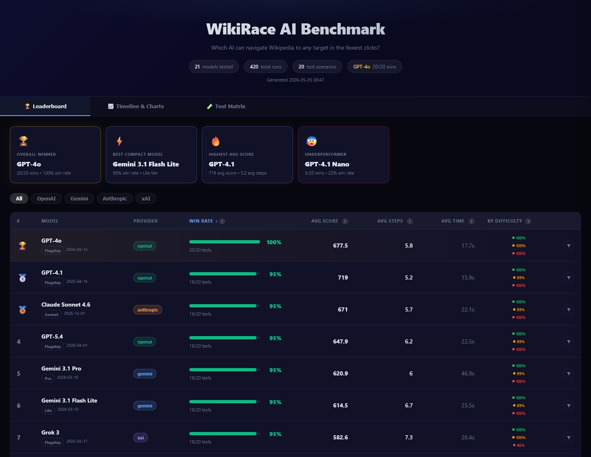
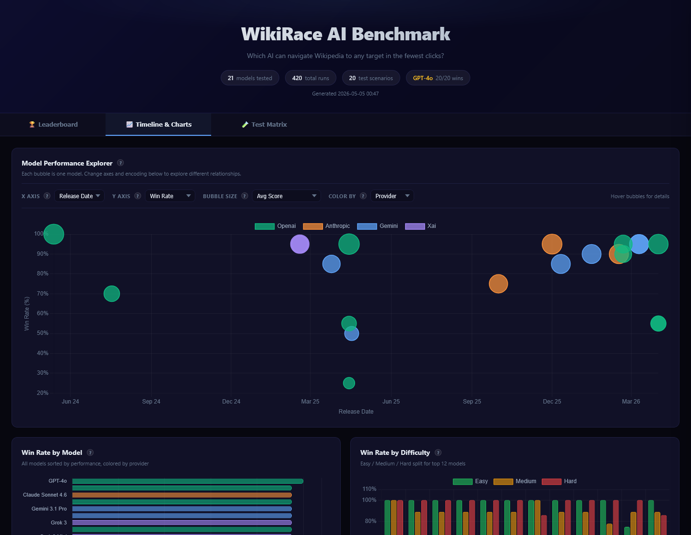

# WikiRace AI Benchmark

**Live:** https://wiki-race-673626542594.europe-west1.run.app (Cloud Run, project `zeta-matrix-483109-u9`, region `europe-west1`, service name `wiki-race`)

This project is a small research-style benchmark for evaluating how AI models navigate a real knowledge network.

Instead of measuring only question answering or static reasoning, the benchmark asks models to move through Wikipedia as a graph: start from one article, choose links step by step, and reach a target page as efficiently as possible. That makes the project part AI evaluation, part benchmark design, and part network-science experiment.

## Screenshots

### App







## Research framing

Wikipedia is treated here as a large directed network of concepts. Each article is a node, each article link is an edge, and the model acts as an agent trying to traverse that graph under partial information.

The benchmark is meant to probe questions like:

- How well can a model reason over local graph structure without seeing the whole network?
- Can it make efficient pathfinding decisions in a semantic network?
- Does stronger language modeling translate into better navigation strategy?
- Which models are fast, robust, or sample-efficient on multi-step search tasks?

In that sense, the project sits at the intersection of:

- AI agent evaluation
- benchmark engineering
- semantic navigation
- graph search
- network science

## What the benchmark measures

Each run starts from a source Wikipedia article and tries to reach a target article in as few clicks as possible.

The system records:

- success or failure
- number of steps
- elapsed time
- score
- chosen path
- per-step reasoning text

The final leaderboard aggregates those runs across a shared test set so models can be compared on the same navigation problems.

## Repository layout

- `src/wiki_race/`: main package
- `src/wiki_race/web.py`: Flask app
- `src/wiki_race/race.py`: benchmark loop and prompt/response handling
- `src/wiki_race/providers.py`: model provider calls
- `src/wiki_race/storage.py`: config/results persistence
- `src/wiki_race/reporting.py`: static leaderboard generator
- `src/wiki_race/templates/`: web UI templates
- `data/`: benchmark input and output data
- `docs/`: generated report, screenshots, and archived prototype material
- `scripts/`: secondary script entry points
- `wiki_evaluator.py`, `run_tests.py`, `generate_leaderboard.py`, `smoke_test.py`: simple root-level commands

## How it works

For each benchmark run, the evaluator:

1. Loads the current Wikipedia article and extracts valid outgoing article links.
2. Builds a prompt that includes the current page, path history, target, and candidate links.
3. Asks the selected model to choose the next step.
4. Repeats until the target is reached or the maximum step count is exceeded.
5. Stores the outcome for later aggregation and visualization.

To keep the task meaningful, the benchmark blocks obvious hub or meta pages that would trivialize navigation.

## Setup

Install the package and the provider libraries you want to use:

```bash
pip install -e .
pip install google-genai anthropic
```

Core dependencies are declared in `pyproject.toml`. The extra provider packages are optional unless you want to benchmark those providers.

## Test it locally

Start the Flask app:

```bash
python wiki_evaluator.py
```

Then open:

```text
http://localhost:5050
```

From there:

1. Open the `Settings` tab.
2. Paste one or more provider API keys.
3. Return to the `Race` tab.
4. Select the models you want to test.
5. Run a benchmark.

The app stores configuration in `data/config.json` and benchmark results in `data/results.json`.

You can also create `data/config.json` manually before starting the app:

```json
{
  "openai_key": "sk-...",
  "gemini_key": "AIza...",
  "anthropic_key": "sk-ant-...",
  "xai_key": "xai-..."
}
```

## Run the benchmark suite

Run the predefined benchmark set against one or more models:

```bash
python run_tests.py openai/gpt-4o
python run_tests.py openai/gpt-4o gemini/gemini-3.1-flash-lite-preview
```

## Run a smoke test

Run a single benchmark case and regenerate the static report:

```bash
python smoke_test.py
```

## Generate the report

```bash
python generate_leaderboard.py
```

This writes the static HTML report to:

```text
docs/leaderboard.html
```

## Deploy it yourself

This project is simple to self-host as a personal Flask app on a small server or app platform such as Render, Railway, Fly.io, or a VPS.

Basic deployment flow:

1. Clone the repo on the server.
2. Install the Python dependencies.
3. Start the app with:

```bash
python wiki_evaluator.py
```

4. Expose port `5050`, or run it behind a reverse proxy such as Nginx or Caddy.
5. Add your provider keys either through the deployed web UI or by creating `data/config.json` on the server.

This setup works well for personal use, private testing, or sharing with a small trusted group.

## Notes

- `data/results.json` is the source data for the leaderboard.
- The benchmark is intentionally lightweight and exploratory rather than a formal academic evaluation suite.
- `ai_bot.py` and `scripts/prototype_bot.py` preserve the earlier standalone prototype for reference.
